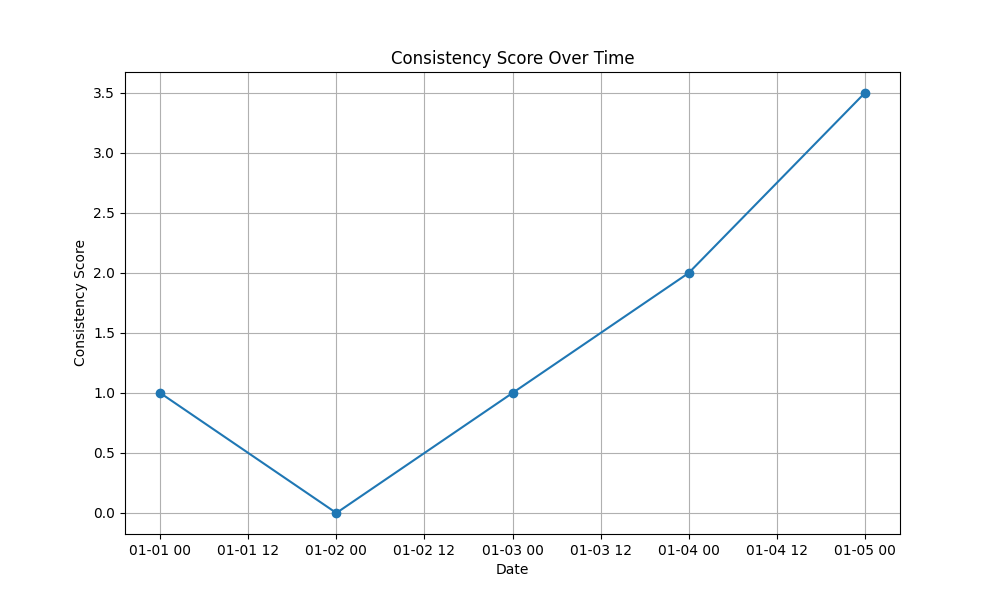

# Shauntal Tracker
Module for plotting consistency of a behavior for productivity purposes

**Simple App Functions**
- calculate_consistency(data)
  - data: [bool-date pairs]
  - returns: [score-date pairs]

- save_plot (plot_title, data, filename)
  - plot_title: title of the graph
  - data: [score-date pairs]

**Complex App Functions**
- calculate_consistency(data)
  - data: [name-bool-date pairs]
  - returns: [name-score-date pairs]

- save_plot (plot_title, data, filename)
  - data: [name-score-date pairs]
  - purpose: creates sub-plots for each name

**Example Plot**
